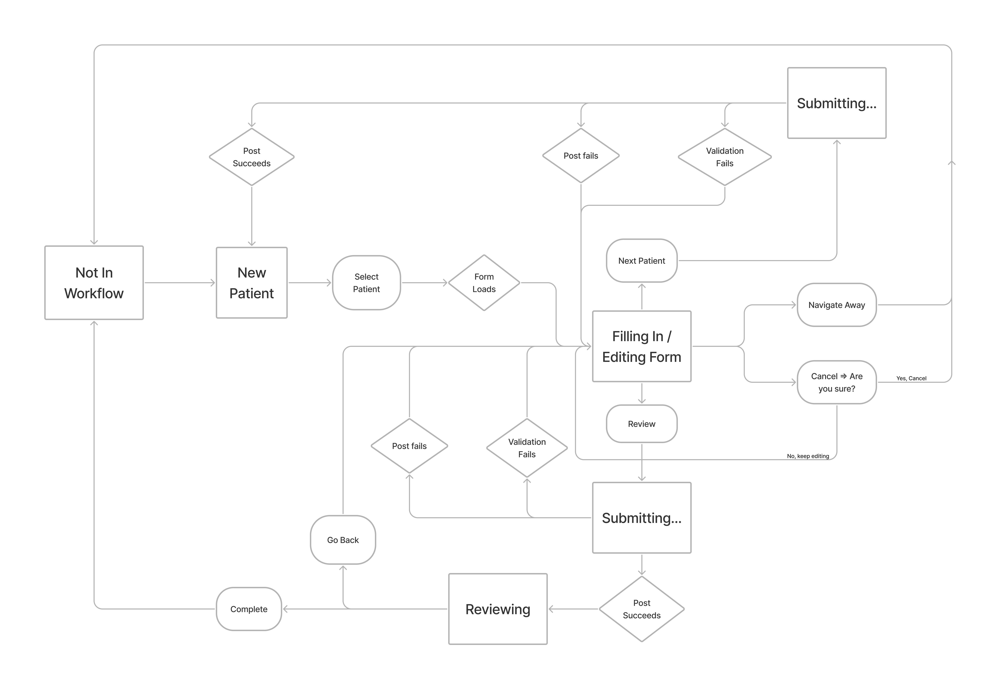

# OpenMRS ESM Fast Data Entry App

The Fast Data Entry App is a module for the [OpenMRS](https://openmrs.org/) healthcare platform which allows for a natural workflow when entering many pre-recorded forms at a time. It is not meant for point-of-care workflows, but rather as a way to do retrospective data entry.

## Overview
Currently the app consists of three main parts, a Forms Page to list available forms, Fast Data Entry which allows the rapid input of forms, and Group Sessions which enable recording information about a group session as well as individual forms for the session participants.

### Forms Page
The Forms page lists all forms able to be seen by a user, filtered by that user's permission to edit the given form. Additionally implementors are able to customize the page by creating form categories and listing the forms inside of each category. These categories can then be shown or hidden using configuration (see more [here](docs/configuring-form-categories.md)). From these lists forms are able to be opened in the Form Workflow using the 'Fill form' button.

### Fast Data Entry
Forms can be entered quickly with the Form Entry Workflow. This workflow depends on a state machine managed by the [FormWorkflowReducer](src/context/FormWorkflowReducer.ts).

See the video below of a normal workflow.

https://user-images.githubusercontent.com/5445264/181378774-341b2a2f-3ecc-4052-b960-d61ba07980fb.mov

State diagram for the Form Workflow.



### Group Sessions
Group Sessions can be recorded with use of the Group Session Workflow. This workflow depends on a state machine managed by the [GroupFormWorkflowReducer](src/context/GroupFormWorkflowReducer.ts).

See the video below of a normal workflow

https://user-images.githubusercontent.com/5445264/194318314-90bf95a0-cbbc-4ed2-9f83-f8e20d317fbf.mov

At the end, data from the group session will be visible on the patient's chart


### Group Builder

This app also contains a Group Builder for quickly putting together a group of patients and storing them as a cohort. While this feature arose to meet the needs of the workflow the concept is valid for the broader platform and could, some day, be moved to a more central location so more apps could make use of it. [AddGroupModal](https://github.com/openmrs/openmrs-esm-fast-data-entry-app/blob/main/src/add-group-modal/AddGroupModal.tsx) was created in a way to reduce external dependencies so this eventual transition would be easier.

https://user-images.githubusercontent.com/5445264/190840219-ec032792-0479-4676-8312-24064edb6afc.mov


## Running this code

Clone the repo locally, then install and run using

```sh
yarn  # to install dependencies
yarn start  # to run the dev server
```

To customize your development build pass other arguments to yarn start (which under the hood is running `npx openmrs develop`). For example to point to a backend other than [dev3](https://dev3.openmrs.org/)  specify the `--backend` option. See the full example below for running against an ICRC backend.

```sh
yarn start --importmap "https://spa-modules.nyc3.digitaloceanspaces.com/import-map.json" --backend "https://openmrs-dev-v2.test.icrc.org/" --add-cookie "MRHSession=abcdefghijklmnop012345678910" --spa-path "/ui"
```

To see more options run `npx openmrs --help`
