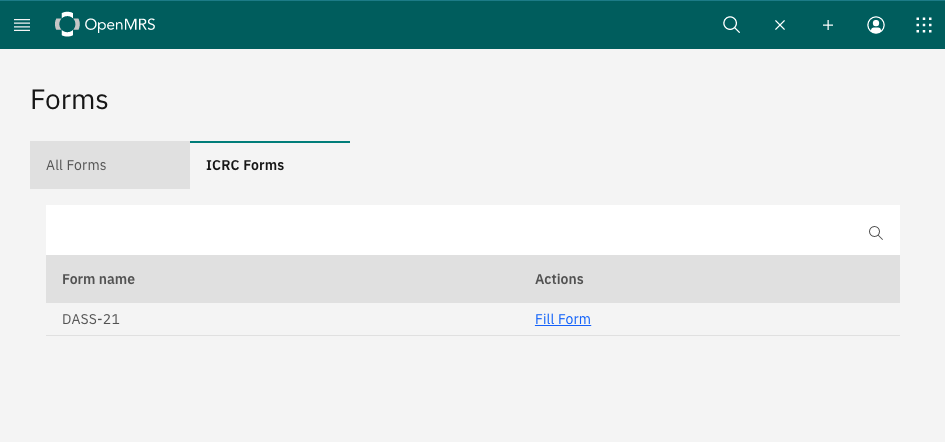
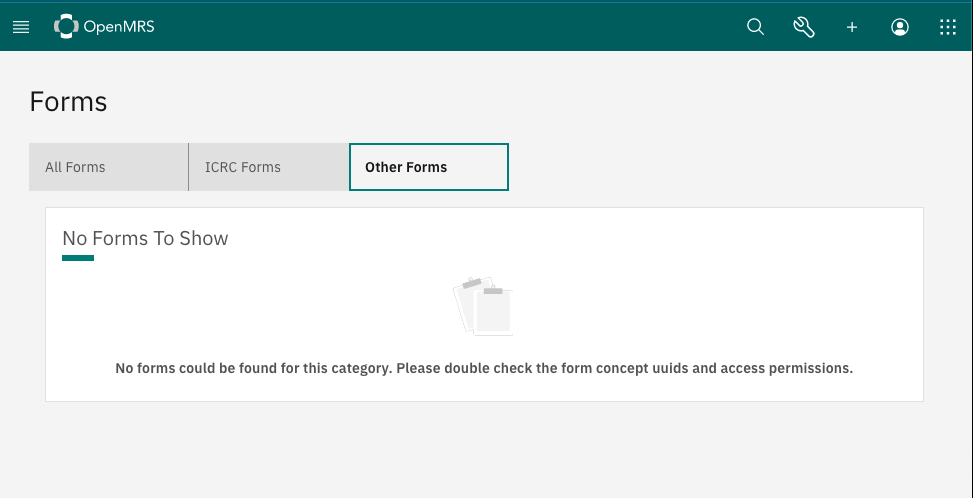

# Configuring Form Categories for Fast Data Entry App

Configuration of which Form Categories to show, and which forms exist within each category is possible via configuration of Fast Data Entry App [config-schema](../src/config-schema.ts). For example, the configuration would setup one category "ICRC Forms" which contains one form, DASS-21. Note that formUUID must match the form UUID on the backend instance, and name is only for human readability and has no actual function.

```json
{
  "@openmrs/esm-fast-data-entry-app": {
    "formCategories": [
      {
        "name": "ICRC Forms",
        "forms": [
          {
            "formUUID": "373086b0-0a65-3763-ab83-21b8867bbc6f",
            "name": "DASS-21"
          }
        ]
      }
    ],
    "formCategoriesToShow": [
      "ICRC Forms"
    ]
  }
}
```

This config results in the following UI:



Note that All Forms is always present and contains all forms the system can find.

Let's see another example. The following config will load up one more form category called "Other Forms" to show, but both entries in that form category are not able to be found in the system, so no forms will render when we navigate to the "Other Forms". Also note that "Third Category of Forms" is declared, but since it's not included in the formCategoriesToShow array it is not displayed on the UI.

```json
{
  "@openmrs/esm-fast-data-entry-app": {
    "formCategories": [{
        "name": "ICRC Forms",
        "forms": [{
          "formUUID": "373086b0-0a65-3763-ab83-21b8867bbc6f",
          "name": "DASS-21"
        }]
      },
      {
        "name": "Other Forms",
        "forms": [{
            "formUUID": "00000000-0a65-3763-ab83-21b",
            "name": "No Matching UUID"
          },
          {
            "formUUID": "This isn't a UUID!",
            "name": "Invalid UUID"
          }
        ]
      },
      {
        "name": "Third Category of Forms",
        "forms": [{
          "formUUID": "ce7a6da7-444a-3038-bfc2-334ff84b86c0",
          "name": "CRIES-8"
        }]
      }
    ],
    "formCategoriesToShow": [
      "ICRC Forms",
      "Other Forms"
    ]
  }
}
```

This will render the following UI




For more information on using the OpenMRS configuration system see [this page](https://o3-dev.docs.openmrs.org/#/main/config)
